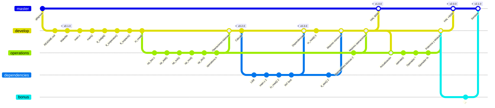

<div align="center">
    
    <p>
        The 9000 series is the most reliable computer ever made.<br>
        No 9000 computer has ever made a mistake or distorted information.<br>
        We are all, by any practical definition of the words, foolproof and incapable of error.
    </p>
</div>

---

# I.    Introducción

Ya que *42 The Network* usa referencias del libro "Guía del autoestopista galáctico", yo voy a usar referencias de otra historia: una que explora el universo y las posibilidades de la tecnología y la inteligencia artificial, pero más allá de eso, una historia que nos invita a reflexionar sobre la naturaleza humana y la búsqueda de respuestas a las preguntas más profundas de la existencia.


# II.   Instrucciones generales

Este proyecto seguirá la misma dinámica que cualquier otro proyecto del *cursus*:
- Tu *Makefile* debe contener las reglas *all*, *NAME*, *clean* y *fclean*.
- El código de tu programa debe seguir la Norma.
- Tu programa debe compilarse usando las *flags* `-Wall -Wextra -Werror`.
- Tu programa no debe producir errores de ejecución.

No obstante, para este proyecto en particular se añadirá algo nuevo, un buen uso de Git:
- **Se debe aplicar el *Flujo de Trabajo de Git* al desarrollo.**
- Tu proyecto usará 2 ramas básicas: la rama principal `master` y de desarrollo `develop`.
- Tu proyecto tendrá varias versiones: *MAJOR* (`X.0.0`) se etiquetarán en `master`; el resto en `develop`.
- Todas las versiones de tu proyecto deben definirse siguiendo el [versionado semántico](https://semver.org/lang/es/).


# III.  Resultados esperados

**Un uso correcto de Git durante el desarrollo del proyecto.**  
Este taller no trata sobre *lenguaje C*; así que lo importante no será el resultado final, sino el proceso.  
Se espera que tu repositorio que contenga:
- *Commits* bien redactados, relevantes y estructurados.
- *Branches* bien definidas, cuyos cambios reflejen un tema concreto.
- *Merges* que no dejen el repositorio en un estado inconsistente.
- *Tags* que reflejen un estado concreto del proyecto.


# IV.   Ejercicio

**¡ATENCIÓN!**  
Este proyecto está estructurado de una forma distinta a la que podrías estar acostumbrado: lee detenidamente este apartado antes de empezar a trabajar y **realiza lo pedido de la forma pedida**.
- Antes de cada tarea se indica la `rama` en la que debe realizarse; si la rama no existe, créala.

**Tareas y versiones.**  
Este proyecto está dividido en versiones, a su vez divididas en tareas.
- Debes completar correctamente todas las tareas de una versión para desarrollar la siguiente.
- Debes completar las tareas en el orden en el que se presentan (resultará más fácil y cómodo).
- Debes hacer un *commit* al completar una tarea. Usa descripciones cuando consideres necesario.
- Debes etiquetar una versión al terminar su última tarea y antes de empezar la siguiente versión.

**Observaciones.**  
- Si una versión no cumple todos sus requisitos, deberás corregirlos y etiquetarlos como *MINOR*.
- Las tareas están indicadas con *casillas* (`[ ]`), márcalas con un *check* (`[x]`) al completarlas.


## Parte obligatoria

Crearás un programa que simula una calculadora.
- Recibirá expresiones aritméticas de 2 elementos como un solo argumento de tipo `string`.
- Mostrará su resultado (o un mensaje de error) por la salida estándar (la consola).
    - Si no recibe ningún argumento, mostrará un mensaje de ayuda.
- Devolverá `0` si la expresión es correcta, o `1` si hay algún error.

Ejemplo de uso:
```shell
$> ./HAL
Usage: HAL "num op num"
    where
        <num> is a number
        <op> is one of '+ - * /' operators

$> ./HAL "1 + 2"
3

$> ./HAL "  34  *  5  "
170

$> ./HAL "678 / 0"
Error: not a number

$> ./HAL " 9   + -10 "
-1

$> ./HAL "1 +" "2"
Error: bad expression

$> ./HAL "+ 1 2"
Error: bad expression

$> ./HAL "1 + 2 + 3"
Error: bad expression
```

### Repositorio

Configura tu repositorio local:
- Crea un repositorio llamado *gt_calculator* en tu carpeta de usuario del sistema.
- Edita su configuración local para que use tu usuario y correo de GitHub.

Después, dale un toque personal:
- Crea un alias del comando `git log` que muestre el resultado de una forma similar a esta:
```shell
* 1a2b3c4 (HEAD -> master) 'Error de lectura' implementado
| * 8h9i0j1 (develop) Función ft_isoperator() implementada
| * 2k3l4m5 Función ft_isdigit() implementada
| | * 4n5o6p7 (operations) Fichero 'operations.c' creado
| |/
| * 6n7o8p9 Fichero 'Makefile' creado
| * 6n7o8p9 Fichero 'main.c' creado
|/
* 9q0r1s2 Fichero '.gitignore' creado
```
> Tiene que ver con *decorar* la salida del comando mostrando un *grafo*, ¡y un par de atributos más!  
> Si tan solo hubiera una forma de consultar documentación en la consola o unas diapositivas muy chulas...


### [v0.1.0] Inclusión de recursos

La calculadora aún no hace nada, pero se añaden los recursos necesarios para empezar a trabajar.

`master`:
- [ ] Crea un fichero `.gitignore` que ignore los ficheros temporales de *C* y los ejecutables.


`develop`:
- [ ] Añade este `README.md` a tu repositorio; a partir de ahora, marca las tareas al completarlas.
- [ ] Crea el fichero `Makefile` que compile tu programa y cree un ejecutable llamado `HAL`.


### [v0.2.0] HAL 1000

La calculadora:
- El formato de entrada es "num1 op num2", solo como "número, espacio, operador, espacio, número".
- Si no es el formato descrito, muestra "Error: bad expression".
- Solo recibe números positivos de un solo dígito.
- Los operadores recibidos solo pueden ser `+`, `-`, `*` o `/`.


```shell
$> ./HAL "1 + 2"
3

$> ./HAL "34 * 5"
"Error: bad expression"

$> ./HAL "6 / 0"
"Error: not a number"

$> ./HAL "9 - -1"
"Error: bad expression"

$> ./HAL "1 - 9"
-8

$> ./HAL "+ 1 2"
"Error: bad expression"
```

---

`develop`:
- [ ] Crea el fichero `main.c` (archivo principal).
- [ ] `main.c`: crea `main(int argc, int[] args)` que solo ejecuta `return (0)`.
- [ ] `main.c`: crea `ft_isdigit(char d)` que indica si un carácter es un dígito.
- [ ] `main.c`: crea `ft_isoperator(char o)` que indica si un carácter es un operador.
- [ ] `main.c`: crea `ft_isspace(char s)` que indica si un carácter es un espacio.
- [ ] `main.c`: crea `in_read(char * str)` que lee y devuelve una expresión en un `char exp[3]`.
    - La expresión se almacena como `exp[0] = num1`, `exp[1] = op` y `exp[2] = num2`.

`operations`:
- [ ] Crea el fichero `operations.c` (operaciones básicas).
- [ ] `operations.c`: crea `op_add(int a, int b)` que suma dos números.
- [ ] `operations.c`: crea `op_sub(int a, int b)` que resta dos números.
- [ ] `operations.c`: crea `op_mul(int a, int b)` que multiplica dos números.
- [ ] `operations.c`: crea `op_div(int a, int b)` que divide dos números.
- [ ] Crea el fichero `operations.h` con las cabeceras de las funciones anteriores.
- [ ] Fusiona los cambios `operations -> develop`.

`develop`:
- [ ] `main.c`: utiliza los cambios recibidos en la fusión para que tu calculadora, calcule.
    - Lee el contenido de `exp[]` y según el operador, llama a la función de `operations.c` adecuada.
    > Recuerda que tu array `exp[]` contiene `char` y las funciones de `operations.c` reciben `int`.


### [v0.3.0] HAL 4500

La calculadora:
- El formato de entrada es "num1 op num2", con cualquier cantidad de espacios entre cada elemento.
- Los números recibidos son de tipo `int` (aceptando ahora negativos y más de un dígito).
- Si el número supera el límite de `int`, muestra "Error: number overflow".

```shell
$> ./HAL "1 + 2"
3

$> ./HAL "34 * 5"
"Error: bad expression"

$> ./HAL "6 / 0"
"Error: not a number"

$> ./HAL "96786 - -1"
96787

$> ./HAL "1 - 9"
-8

$> ./HAL "+ 1 2"
"Error: bad expression"

$> ./HAL "2147483647 + 1"
"Error: number overflow"
```

Si te das cuenta, necesitarás la función `ft_atoi()` para convertir los números de `char` a `int`, porque no sabes cuántos dígitos tendrá cada número.

Por otra parte, también sería ideal que simplemente pudieras trabajar con cada elemento por separado, por lo que es muy buena idea usar `ft_split()` para separar y aislar cada elemento de la expresión.

Y ya puestos, acabas de repetir funciones simples como `ft_isdigit()` que ya hiciste en *Libft*, sería más conveniente usar esa librería y ahorrar futuro trabajo duplicado.

---

`dependencies`:
- [ ] Añade tu librería *Libft* al repositorio (recuerda borrar su carpeta `.git` o sufrirás las consecuencias).
- [ ] `main.c`: incluye la librería *Libft* y elimina las funciones duplicadas.
- [ ] `main.c`: modifica `in_read()` para que use `ft_split()` y `ft_atoi()` (separa y trata la expresión).
- [ ] `main.c`: modifica `in_read()` para que compruebe el límite de los `int`; incluye `<limits.h>`.
- [ ] Fusiona los cambios `dependencies -> develop`.

`develop`:
- Asegúrate de que tu programa funciona correctamente tras la fusión; si no, corrige los errores.


### [v1.0.0] HAL 9000

La calculadora:
- Los números recibidos son de tipo `long`.


```shell
$> ./HAL "1 + 2"
3

$> ./HAL "34 * 5"
"Error: bad expression"

$> ./HAL "6 / 0"
"Error: not a number"

$> ./HAL "9 - -1"
10

$> ./HAL "1 - 9"
-8

$> ./HAL "+ 1 2"
"Error: bad expression"

$> ./HAL 2 ^ 4
16

$> ./HAL 3 ^ 0
1

$> ./HAL 4 ^ -2
Error: not a number

$> ./HAL 0 ^ 3
Error: not a number
```

---

`dependencies`:
- [ ] `ft_atoi()`: modifica la función para que acepte números de tipo `long`.

`develop`:
- [ ] `main.c`: modifica `in_read()` para que compruebe el límite de los `long`.
- [ ] Fusiona los cambios `dependencies -> develop`.

`operations`:
- [ ] `operations.c`: modifica las funciones para que acepten números de tipo `long`.
- [ ] Fusiona los cambios `operations -> develop`.

`develop`:
- Asegúrate de que tu programa funciona correctamente tras la fusión.
- [ ] Fusiona los cambios `develop -> master`.


## Parte bonus

Ahora que ya has desarrollado tu primera *release* de la calculadora, es hora de añadirle nuevas funciones y mejorar su rendimiento realizando cambios de categoría *MAJOR*.


### [v2.0.0] HAL +9000

La calculadora:
- Optimiza el código del cálculo de las operaciones.
- La calculadora ahora puede trabajar con potencias (`^`) y módulos (`%`).

> **NOTA:** Se suponen los siguientes casos como "Error: not a number".
> - La potencia de 0 o un exponente negativo.
> - El módulo de 0 o un módulo negativo.

```shell
$> ./HAL 14 % 5
4

$> ./HAL 2 % 4
2

$> ./HAL 3 % 0
"Error: not a number"

$> ./HAL 4 % -2
"Error: not a number"

$> ./HAL 0 % 899
0
```

---

`operations`:
- [ ] Fusiona los cambios `develop -> operations` para actualizar esta rama con los cambios de `develop`.
- [ ] Combina `op_*()` en una sola función `operate(long a, char op, long b)`.
- [ ] `operations.c`: añade el operador `^` a la función `operate()`.
- [ ] `operations.c`: añade el operador `%` a la función `operate()`.
- [ ] Fusiona los cambios `operations -> develop`.


### [v2.1.0] Become sentient

La calculadora ahora añade colores y *consciencia propia*.

```shell
$> ./HAL "0 ^ 2001"
"I'm afraid, Dave."

$> ./HAL "    9000 "
"The 9000 series is the most reliable computer ever made."

$> ./HAL "42 + 42"
84

$> ./HAL "42 + 9000"
9042

$> ./HAL " 42   "
"Sorry, Dave. I'm afraid I can't do that."
```

---

Para estas últimas tareas, usa tu cabeza y la experiencia de todo lo que has estado haciendo hasta ahora: desarrolla estos cambios en una rama `bonus` que parte del último *commit* de `develop`, pero siéntete libre de implementar lo pedido como mejor te parezca.

`bonus`:
- [ ] Implementa que los mensajes de la calculadora se muestren en los colores indicados.

| Mensaje                  | Color    |
| :----------------------: | :------: |
| "Error: bad expression"  | rosa     |
| "Error: number overflow" | morado   |
| "Error: not a number"    | azul     |
| "Usage"                  | verde    |
| Resultado                | amarillo |
| Entrada especial         | rojo     |

- [ ] Implementa la *consciencia propia* de la calculadora para que hable en casos específicos.

| Entradas especiales | Mensaje                                                    |
| :-----------------: | :--------------------------------------------------------: |
| "`2001` op num2"    | "I'm afraid, Dave."                                        |
| "num1 op `2001`"    | "I'm afraid, Dave."                                        |
| "`9000`"            | "The 9000 series is the most reliable computer ever made." |
| "`42`"              | "Sorry, Dave. I'm afraid I can't do that."                 |


# Evaluación

Me temo que, *legalmente hablando*, no hay forma de evaluar el proyecto, así que no hay evaluación.

*Sí obstante*, si quieres vacilar sobre quién tiene la rama más larga, siempre puedes pedírselo a tus compañeros, ¡nadie te lo va a impedir!

Una forma de evaluar el proyecto de alguien es comprobando que para cada versión, se cumplen las tareas de dicha versión; recuerda que puedes comprobar las versiones de un repositorio con:
```shell
$> git checkout <versión>
```

Tu resultado final debería ser algo parecido a este árbol de trabajo:


---

- Proyecto creado por [**@15Galan**](https://srgalan.vercel.app).
