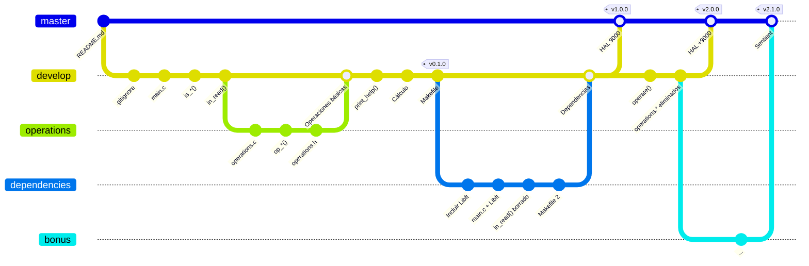

<div align="center">
    
    <p>
        <i>
        The 9000 series is the most reliable computer ever made.<br>
        No 9000 computer has ever made a mistake or distorted information.<br>
        We are all, by any practical definition of the words, foolproof and incapable of error.
        </i>
    </p>
</div>

---

# I.    Introducción

Esto no es "Guía del autoestopista galáctico".

# II.   Instrucciones generales

Este proyecto seguirá la misma dinámica que cualquier otro proyecto del *cursus*: reglas del *Makefile*, *Norma\**, etc; no obstante, para este proyecto en particular se añadirá algo nuevo: **un buen uso de Git**.
- Se debe aplicar el *Flujo de Trabajo de Git* al desarrollo.
- Tu proyecto usará 2 ramas básicas: la rama principal `master` y de desarrollo `develop`.
- Tu proyecto tendrá varias versiones: *MAJOR* (`x.0.0`) en `master`, y el resto en `develop`.
- Todas las versiones de tu proyecto deben definirse siguiendo el [versionado semántico](https://semver.org/lang/es/).

\* La *Norma* va a molestar un poco, así que no la vamos a tener muy en cuenta. Guarda el secreto.

# III.  Resultados esperados
 
Este taller no trata sobre *lenguaje C*; así que lo importante no será el resultado final, sino el proceso.

Se espera que tu repositorio contenga:
- ***Commits*** bien redactados, relevantes y estructurados.
- **Ramas** bien definidas, cuyos cambios reflejen un tema concreto.
- **Fusiones** que no dejen el repositorio en un estado inconsistente.
- **Etiquetas** que reflejen un estado concreto del proyecto.

# IV.   Ejercicio

## Antes de empezar

Este proyecto está estructurado de una forma distinta a la que podrías estar acostumbrado: lee detenidamente este apartado antes de empezar a trabajar y **realiza lo pedido de la forma pedida**.

**Todo el código necesario ya está programado en *recursos***, por lo que para realizar las tareas, solo tendrás que colocarlo adecuadamente o bien realizar pequeñas modificaciones sobre un código que ya hayas usado.

---

**Tareas y versiones.**  

Este proyecto está dividido en versiones, a su vez divididas en tareas.

- Debes completar correctamente todas las tareas de una versión para desarrollar la siguiente.
- Debes completar las tareas en el orden en el que se presentan (te resultará más fácil y cómodo).
- Debes hacer un *commit* al completar una tarea; usa descripciones cuando consideres necesario.
- Debes etiquetar una versión al terminar su última tarea y antes de empezar la siguiente versión.

**Observaciones.**

- Antes de cada tarea se indica la `rama` en la que debe realizarse; si la rama no existe, créala.
- Al inicio de cada versión se muestra un ejemplo del funcionamiento de la calculadora en esa versión.
- Si una versión no cumple todos sus requisitos, deberás corregirlos y etiquetarlos como *PATCH* ([versionado semántico](https://semver.org/lang/es)).
- Las tareas están indicadas con *casillas* (`- [ ]`).

## Descripción

Crearás un programa que simula una calculadora.

- Recibirá expresiones aritméticas de 2 elementos como un solo argumento de tipo `string`.
- Mostrará su resultado por la salida estándar.
- Mostrará un mensaje de ayuda si no recibe ningún argumento.
- Mostrará un mensaje de error, en función del error, en cualquier otro caso.

Ejemplo de uso:

```shell
$> ./HAL
Usage: HAL "num op num"
    where
        <num> is a number
        <op> is one of '+ - * /' operators

$> ./HAL "1 + 2"
3

$> ./HAL "  34  *  5  "
170

$> ./HAL "678 / 0"
Error: not a number

$> ./HAL " 9   + -10 "
-1

$> ./HAL "1 +" "2"
Error: bad expression

$> ./HAL "+ 1 2"
Error: bad expression

$> ./HAL "1 + 2 + 3"
Error: bad expression
```

## Parte obligatoria

### Repositorio

Antes de empezar, será necesario un repositorio; además, vamos a configurarlo un poco para que sea más cómodo trabajar con él.

- [ ] Crea un repositorio llamado *gt_HAL9000* en tu carpeta de usuario del sistema.
- [ ] Modifica la configuración **local** para cambiar los campos `user.name`, `user.email` y `merge.ff`:
    - Usa tu nombre o un mote (cuidado, aparecerá en los *commits*).
    - Usa tu correo de GitHub (si usas varios, elige el más bonito).
    - Desactiva los *merge fast-forward*. **No te saltes este paso** (si no sabes qué es esto, *¡Up2U!*).
- [ ] Modifica tu configuración **global** para crear el alias `git lg`:
    - Crea un alias que muestre la salida de `git log` mostrando **un *commit* por línea** de **todas las ramas** y **decorado** como un **[grafo](https://es.wikipedia.org/wiki/Grafo)**.

> [!TIP]
> Este comando aparece en *ciertas* diapositivas.

---

Tu configuración local debería quedar de la siguiente forma:

```
[user]
    name = <un nombre>
    email = <tu correo de GitHub>

[merge]
    ff = false
```

Si el alias está bien configurado, deberías obtener una salida similar a la mostrada a continuación al ejecutar `git lg`; si no muestra nada, probablemente sea porque todavía no has hecho ningún *commit*, y por tanto, no hay nada que mostrar.

```
* 1a2b3c4 (HEAD -> master) Errata en el README corregida
| * 8h9i0j1 (develop) Función f() corregida
| * 2k3l4m5 Función f() implementada
| | * 4n5o6p7 (funcionalidad-X) Documentación añadida
| |/
| * 6n7o8p9 Fichero de configuración
|/
* 9q0r1s2 ¡Primer commit!
```

> [!NOTE]
> Este alias te permitirá visualizar tu *Árbol de Trabajo*, algo que te resultará muy útil no solo durante el resto del ejercicio, sino durante el resto de tu vida.

### Inclusión de recursos

La calculadora aún no hace nada, pero se añaden los recursos necesarios para empezar a trabajar.

---

`master`:

- [ ] Añade un *README* que explique el funcionamiento de la calculadora (por ejemplo, con [la descripción de antes](#descripción)).

`develop`:

- [ ] Crea un *.gitignore* que ignore un ejecutable *HAL* y a las extensiones (`.o`, `.tmp` y `.a`).


### [v0.1.0] HAL

La calculadora:

- El formato de entrada es "num1 op num2", solo como "número, espacio, operador, espacio, número".
- Si no es el formato descrito, muestra "Error: bad expression".
- Solo recibe números positivos de un solo dígito.
- Solo recibe los operadores `+`, `-`, `*` o `/`.

> [!WARNING]
> La división devuelve 0 si el denominador es 0.

```shell
$> ./HAL "1 + 2"
3

$> ./HAL "34 * 5"
"Error: bad expression"

$> ./HAL "6 / 0"
"Error: not a number"
"0"

$> ./HAL "9 - -1"
"Error: bad expression"

$> ./HAL "1 - 9"
-8

$> ./HAL "+ 1 2"
"Error: bad expression"
```

---

`develop`:

- [ ] Crea el fichero ***main.c*** (archivo principal).
- [ ] ***main.c***: crea las siguientes funciones simples:
	- *int ft_isdigit(char d)* que indica si un carácter es un dígito (`'0123456789'`).
	- *int ft_isoperator(char o)* que indica si un carácter es un operador (`'+-*/'`).
	- *int ft_isspace(char s)* que indica si un carácter es un espacio (`' '`).
- [ ] ***main.c***: crea *char \*in_read(char \*str)* que lee y devuelve una expresión en un array.

`operations`:

- [ ] Crea el fichero ***operations.c*** (operaciones básicas).
- [ ] ***operations.c***: crea las siguientes funciones:
    - *int op_add(int a, int b)* que suma dos números.
    - *int op_sub(int a, int b)* que resta dos números.
    - *int op_mul(int a, int b)* que multiplica dos números.
    - *int op_div(int a, int b)* que divide dos números.
- [ ] Crea el fichero ***operations.h*** con las cabeceras de las funciones anteriores.
- [ ] Fusiona los cambios `operations -> develop`.

`develop`:

- [ ] ***main.c***: crea la función *void print_help()* que muestra el mensaje de ayuda.
- [ ] ***main.c***: utiliza los cambios recibidos en la fusión para que tu calculadora, calcule.
    - Recibe argumentos por consola; si no hay argumentos, muestra la ayuda.
    - Lee la expresión con *in_read()* y la guarda en un array de 3 elementos `char` si es correcta.
    - Calcula y muestra el resultado con las funciones de ***operations.h***, o el error.
- [ ] Crea un ***Makefile*** que compile tu programa y cree un ejecutable llamado *HAL*.

### [v1.0.0] HAL 9000

La calculadora:

- El formato de entrada es "num1 op num2", con cualquier cantidad de espacios entre cada elemento.

```shell
$> ./HAL "1 + 2"
3

$> ./HAL "34 * 5"
170

$> ./HAL "6 / 0"
"Error: not a number"

$> ./HAL "96786 - -1"
96787

$> ./HAL "1 - 9"
-8

$> ./HAL "+ 1 2"
"Error: bad expression"
```

Si te das cuenta, necesitarás la función *ft_atoi()* para convertir los números de `char` a `int`, porque no sabes cuántos dígitos tendrá cada número.

Por otra parte, también sería ideal que simplemente pudieras trabajar con cada elemento por separado, por lo que es muy buena idea usar *ft_split()* para separar y aislar cada elemento de la expresión.

Y ya puestos, acabas de repetir funciones simples como *ft_isdigit()* que ya hiciste en *Libft*, sería más conveniente usar esa librería y ahorrar futuro trabajo duplicado.

> [!NOTE]
> Si aún no cuentas con una *Libft* operativa, puedes usar [la mía](https://github.com/15Galan/Libft/releases/tag/v1.2.1).

---

`dependencies`:

- [ ] Añade la librería ***Libft*** al repositorio (recuerda borrar su carpeta *.git* o sufrirás las consecuencias).
- [ ] ***main.c***: incluye la librería ***Libft***.
	- Limpia *#include*s atendiendo a *libft.h*.
	- Elimina las funciones duplicadas.
- [ ] ***main.c***: usa funciones de ***Libft***.
	- Elimina *in_read()* y modifica *main()* para que use *ft_split()* y *ft_atoi()* en su lugar.  
Ahora, el operador se almacena como `char **` en lugar de `char *`.
	- Actualiza *ft_isoperator()* para que reciba `char **` y use *ft_strncmp()*.
	- Actualiza *main()* para que también use *ft_strncmp()*.
- [ ] ***Makefile***: actualiza el fichero para que incorpore los archivos de ***Libft***.
- [ ] Fusiona los cambios `dependencies -> develop`.

`develop`:

- [ ] Fusiona los cambios `develop -> master`.

## Parte bonus

Ahora que ya has desarrollado tu primera *release* de la calculadora, es hora de añadirle nuevas funciones y mejorar su rendimiento realizando cambios de categoría *MAJOR*.

### [v2.0.0] HAL +9000

La calculadora:

- El código necesario para calcular operaciones es más óptimo.

```shell
$> ./HAL 14 % 5
4

$> ./HAL 2 % 4
2

$> ./HAL 3 % 0
"Error: not a number"

$> ./HAL 4 % -2
"Error: not a number"

$> ./HAL 0 % 899
0
```

---

Como habrás podido observar, el código para calcular operaciones pedía a gritos una refactorización, así que vas a crear una función genérica de cálculo (en lugar de tener una para cada operación); y al mismo tiempo, eso hará que tus ficheros *operations.c* y *operations.h* no merezcan la pena, porque tienes hueco en *main.c* para añadir la función que quieres, así que vas a sustituir 2 ficheros y 4 funciones, por una sola función en un fichero existente.

Precisamente por esto la versión pasa de `1.0.0` a `2.0.0`, ya que en la primera, se calculaba con 4 funciones distintas y ahora, se sustituyen por una sola; el funcionamiento es distinto y el procesamiento de los datos también.

`develop`:

- [ ] ***main.c***: crea la función *void operate(int a, char \*op, int)*.
- [ ] Elimina los ficheros **operations.\**** y su *#include*.
- [ ] Fusiona los cambios `develop -> master`.

### [v2.1.0] *Become sentient*

La calculadora ahora añade colores y *consciencia propia*.

```shell
$> ./HAL "0 ^ 2001"
"I'm afraid, Dave."

$> ./HAL "    9000 "
"The 9000 series is the most reliable computer ever made."

$> ./HAL "42 + 42"
84

$> ./HAL "42 + 9000"
9042

$> ./HAL " 42   "
"Sorry, Dave. I'm afraid I can't do that."
```

---

> [!CAUTION]
> Lo siento, no hay *recursos* para esto, es el final del bonus. *Up2U!* 

Para estas últimas tareas, usa tu cabeza y la experiencia de todo lo que has estado haciendo hasta ahora: desarrolla estos cambios en una rama `bonus` que parte del último *commit* de `develop`, pero siéntete libre de implementar lo pedido como mejor te parezca.

`bonus`:

- [ ] Implementa que los mensajes de la calculadora se muestren en los colores indicados.

| Mensaje                  | Color    |
| :----------------------: | :------: |
| "Error: bad expression"  | rosa     |
| "Error: not a number"    | azul     |
| "Usage"                  | verde    |
| Resultado                | amarillo |
| Entrada especial         | rojo     |

Los colores vienen como código de caracteres: por ejemplo, digamos que rojo es "\0033", pues si quieres colorear "Hola" con rojo, basta con concatenar el color antes del texto, "\0033Hola"; por otra parte, no hay que olvidar formatear el texto para que vuelva a su color original, que también tiene un código propio.

- [ ] Implementa la *consciencia propia* de la calculadora para que hable en casos específicos.

| Entradas especiales | Mensaje                                                    |
| :-----------------: | :--------------------------------------------------------: |
| "2001 <op> 2001"    | "I'm afraid, Dave."                                        |
| "9000"              | "The 9000 series is the most reliable computer ever made." |
| "42"                | "Sorry, Dave. I'm afraid I can't do that."                 |

Comprobando más opciones de entrada distintas, esto debería ser bastante fácil, ¿no?

# Evaluación

Me temo que, *legalmente hablando*, no hay forma de evaluar el proyecto, así que no hay evaluación.

*Sí obstante*, si quieres vacilar sobre quién tiene la rama más larga, siempre puedes pedírselo a tus compañeros, ¡nadie te lo va a impedir!

Una forma de evaluar el proyecto de alguien es comprobando que para cada versión, se cumplen las tareas de dicha versión; recuerda que puedes comprobar las versiones de un repositorio con:

```shell
$> git checkout <versión>
```

Tu resultado final debería ser algo parecido a este árbol de trabajo:



---

- Proyecto creado por [**@15Galan**](https://srgalan.vercel.app).
